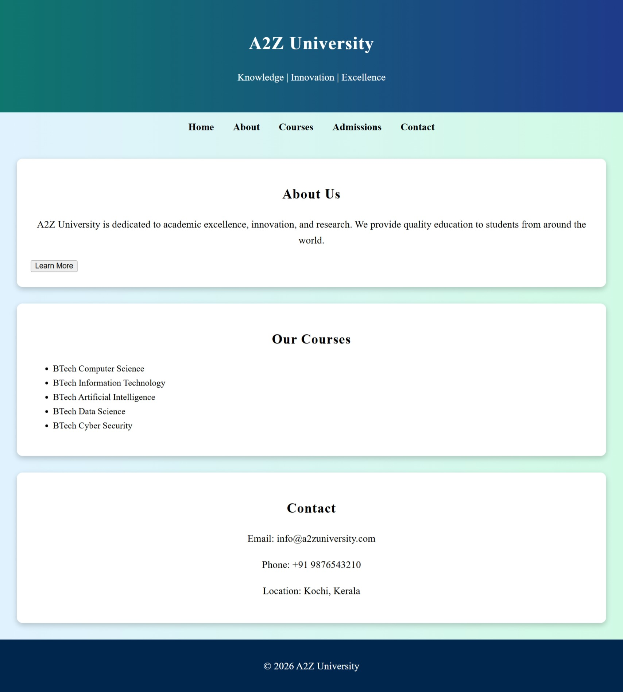

# University Website

This project is a simple university website created using HTML and CSS.

## Description
This website contains a homepage that introduces the university, its courses, and basic information.

## Technologies Used
- HTML
- CSS

## Features
- Navigation bar
- University information section
- Responsive design
- Simple and clean layout

## Website Preview

## GitHub Repository
https://github.com/annzitajoshy-commits/university-website.git

## Author
Your Name
